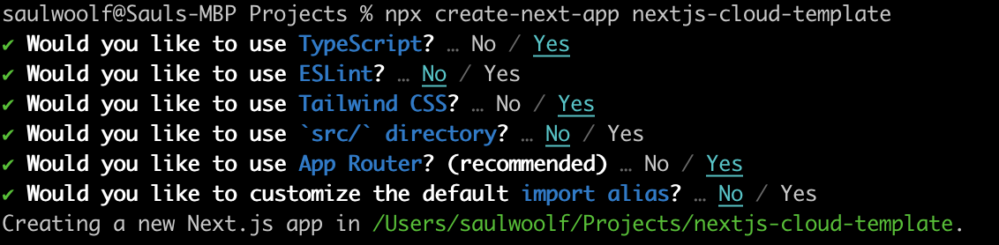

# NextJS app Template for GCP Cloud Run

## Requirements
You will need to install Node/npm, Docker Desktop, and a GCP Account

## Repro Steps

This is a [Next.js](https://nextjs.org/) project bootstrapped with [`create-next-app`](https://github.com/vercel/next.js/tree/canary/packages/create-next-app).



Validate the app works locally: 
```bash
npm run dev
# or
yarn dev
# or
pnpm dev
```

Then added the Dockerfile and docker-compose.yml

Validate it builds and runs:
```bash
docker-compose build
docker-compose up
# then, to shut down
docker-compose down
```

Then added app.json for cloud run and the Cloud Run Button below

[](https://deploy.cloud.run)

Push to github, and push the Cloud Run button

## Troubleshooting

Check your node versions and make sure they match that of the Dockerfile
```bash
node -v
npm -v
next -v
```

you also may need to build locally once before it works in docker:
```bash
npm run build
```